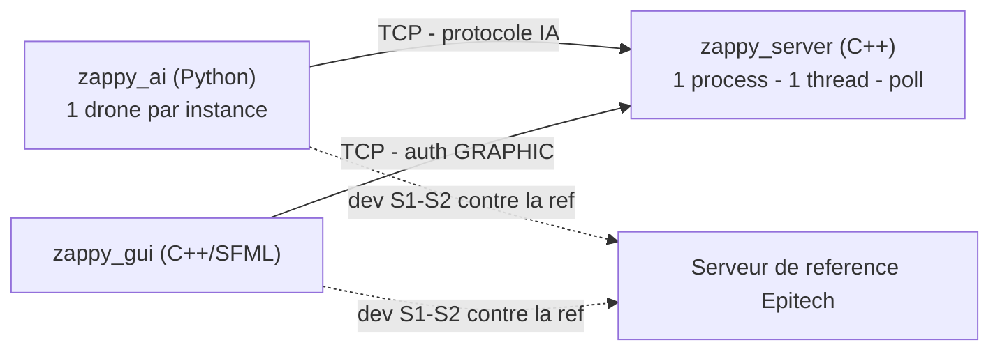
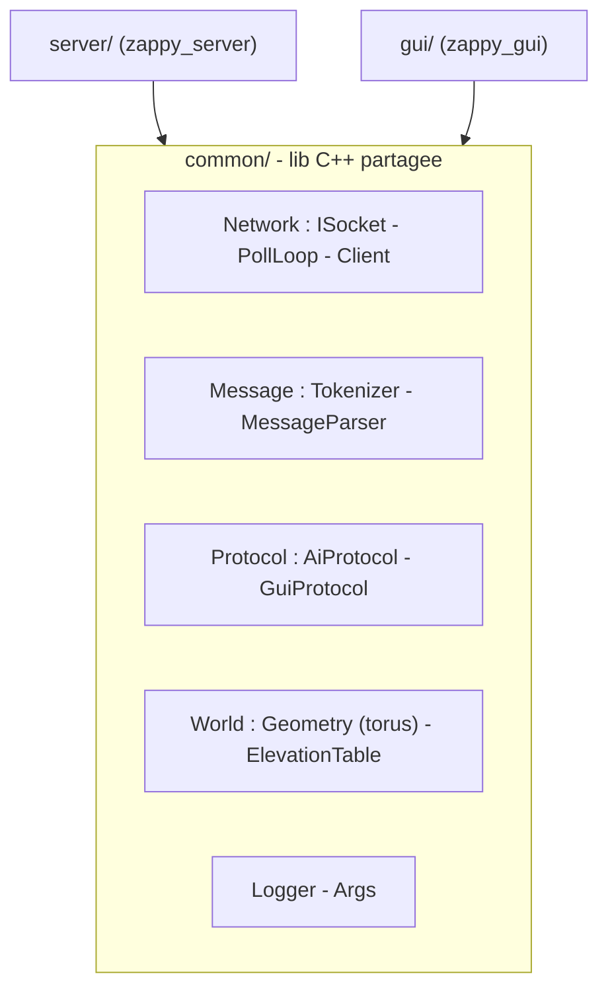
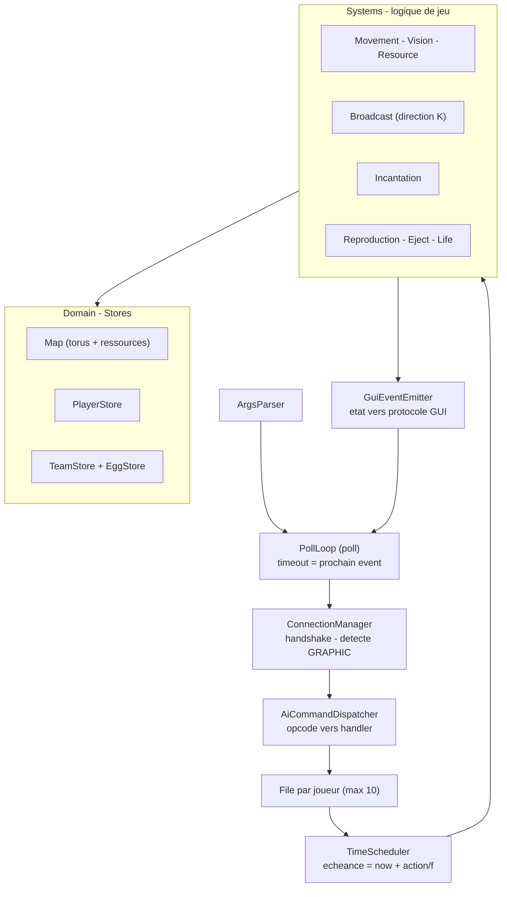
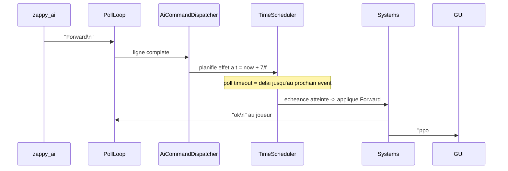
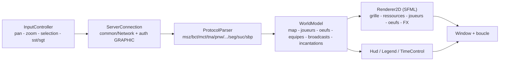
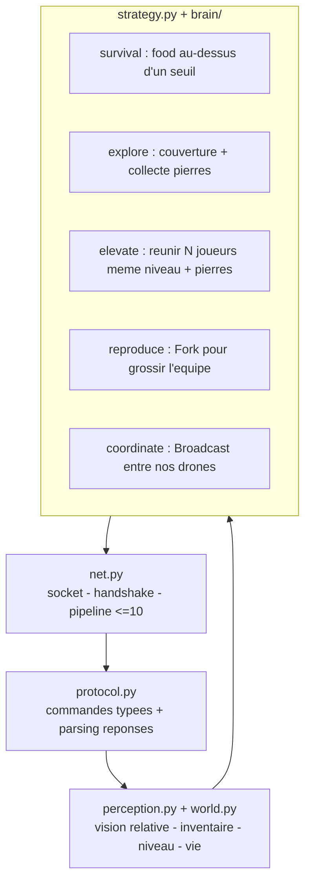
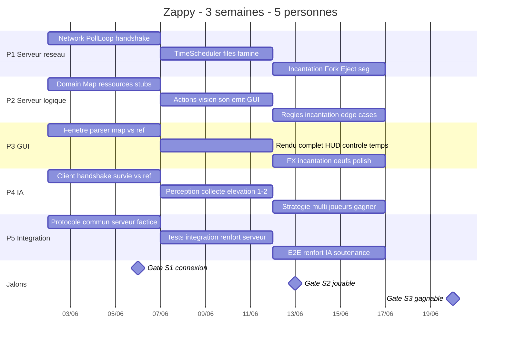

# Zappy — Architecture & plan de développement

> Source de vérité = les deux PDF du sujet (`G-YEP-400_zappy.pdf`,
> `G-YEP-400_zappy_GUI_protocol.pdf`). En cas de divergence, **les PDF font foi**.
>
> Cette architecture **réutilise délibérément** les patterns déjà éprouvés sur
> nos projets `my_teams` (réseau `poll` + dispatch + modules Store/Controller +
> tests GTest sur port éphémère) et `raytracer` (lib statique par module,
> interfaces `I*`, factory/registry, Logger par module). Les chemins de
> référence sont donnés en §4 pour aller relire le code source d'origine.

---

## 1. Décisions clés

| Sujet | Décision | Raison |
|------|----------|--------|
| Langage serveur | **C++20** (et non C) | Le sujet autorise C/C++/Rust ; toutes nos règles `.claude/CLAUDE.md` (R1–R11) sont C++ ; on réutilise tel quel la couche réseau C++ de `my_teams`. |
| Langage GUI | **C++20 + SFML 2.5** | Imposé par le sujet. |
| Langage IA | **Python 3** | Libre ; itération rapide. La même *logique en couches* que le C++ est calquée (cf. §9). |
| Threading serveur | **Mono-thread strict** | Sujet : « one single process and one single thread ». ⇒ **pas** de `ThreadPool` côté serveur (contrairement au raytracer). |
| Réseau | **1 seul `poll`**, I/O bufferisée, jamais d'écriture/lecture bloquante | Sujet : « no active waiting » + « poll must unlock only if something happens ». |
| Code partagé | une lib **`common/`** liée par le serveur **et** le GUI | Évite la divergence du protocole et des maths du tore. |

---

## 2. Ce qu'on doit construire

Trois binaires qui dialoguent en **TCP**. Victoire = **1re équipe avec ≥ 6
joueurs au niveau max (8)**.

```
./zappy_server -p port -x width -y height -n team1 team2 ... -c clientsNb -f freq
./zappy_gui    -p port -h machine
./zappy_ai     -p port -n name -h machine
```

- `-c clientsNb` : slots (œufs) par équipe au départ. `-f freq` : `temps_action = action / f` (défaut `f = 100`).

### Règles cœur à ne pas rater

- **Monde toroïdal** (`Trantor`) : wrap sur les 4 bords (déplacement, vision, son).
- **6 pierres** (linemate, deraumere, sibur, mendiane, phiras, thystame) + **food**.
- **Ressources** : `quantité = width * height * densité`, ré-épandues **toutes les 20 u.t.**
  Densités : food 0.5, linemate 0.3, deraumere 0.15, sibur 0.1, mendiane 0.1, phiras 0.08, thystame 0.05.
- **Survie** : 1 food = **126 u.t.** ; départ 10 food (1260 u.t.) ; plus de food → `dead`.
- **Vision** : portée = niveau ; `Look` renvoie les tuiles 0..N en losange devant.
- **Élévation** : réunir sur **une tuile** N joueurs **de même niveau** + les bonnes pierres.
  Vérif **au début ET à la fin** ; joueurs **gelés** ; pierres consommées au succès.

| Niveau | joueurs | linemate | deraumere | sibur | mendiane | phiras | thystame |
|:------:|:-------:|:--------:|:---------:|:-----:|:--------:|:------:|:--------:|
| 1→2 | 1 | 1 | 0 | 0 | 0 | 0 | 0 |
| 2→3 | 2 | 1 | 1 | 1 | 0 | 0 | 0 |
| 3→4 | 2 | 2 | 0 | 1 | 0 | 2 | 0 |
| 4→5 | 4 | 1 | 1 | 2 | 0 | 1 | 0 |
| 5→6 | 4 | 1 | 2 | 1 | 3 | 0 | 0 |
| 6→7 | 6 | 1 | 2 | 3 | 0 | 1 | 0 |
| 7→8 | 6 | 2 | 2 | 2 | 2 | 2 | 1 |

- **Broadcast/son** : le receveur connaît la **direction K** (n° de tuile par où arrive le son ; 1 = devant, sens trigo ; `0` si même tuile), via le **plus court chemin** sur le tore.
- **Fork** : crée un œuf → nouveau slot. **Eject** : pousse les joueurs de la tuile, détruit les œufs.
- **Buffer IA** : ≤ **10** commandes empilées sans réponse ; exécution **dans l'ordre**.

---

## 3. Vue système



> **Levier de parallélisation #1** : la référence Epitech parle le **même**
> protocole. GUI et IA développent dès le **jour 1** contre la référence, puis
> basculent sur notre serveur en S2. Personne n'attend personne.

---

## 4. Patterns réutilisés (et où relire le code d'origine)

| Pattern | Source à relire | Usage Zappy |
|--------|-----------------|-------------|
| Boucle `poll` + registry `fd→Client` + framing `\n` + buffers I/O non bloquants + drapeau *dirty* | `my_teams/common/Network/Server/PollLoop.{hpp,cpp}`, `Client.{hpp,cpp}` | **Cœur réseau du serveur**, repris quasi tel quel dans `common/Network/`. |
| `ISocket` → `RealSocket` (backend I/O abstrait) | `my_teams/common/Network/Socket/ISocket.hpp` | Tester le serveur **sans vraies sockets** (mock). |
| `Dispatcher` `unordered_map<opcode, handler>` + handlers typés/schéma | `my_teams/common/RPC/Server/Dispatcher.hpp` | `AiCommandDispatcher` (Forward, Look, …) et `GuiCommandDispatcher` (msz, mct, sst…). |
| Module = **Store** (CRUD mémoire) + **Controller/System** (logique) ; câblage par `ControllerLoader` dans `main` | `my_teams/server/src/Modules/*`, `System/ControllerLoader.hpp`, `main.cpp` | `Domain/` (Stores) + `Systems/` (logique), câblés dans `GameServer`. |
| `Session<Ctx>` (état par connexion) | `my_teams/common/RPC/Session/Session.hpp` | `ClientContext` = { type AI/GUI, équipe, player_id }. |
| Tests **GTest** d'intégration sur **port éphémère** (port 0) + fixture par contrôleur | `my_teams/tests/server/TestAuthController.cpp` | Tests d'intégration serveur (cf. §10). |
| 1 **lib statique par module** + CMake racine/per-subdir + `enable_target_warnings()` + `BUILD_TESTS` | `raytracer/CMakeLists.txt`, `src/*/CMakeLists.txt`, `tests/CMakeLists.txt` | Build (cf. §11). |
| Interfaces `I*` pures + base `A*` + **factory/registry** par chaîne | `raytracer/src/factory/*`, `src/scene/SceneLoaderFactory` | `IRenderer` (GUI 2D/3D), `ISocket`, factory de systèmes. |
| **Logger instance-par-module** (R8), `if constexpr` compile-time | `raytracer/src/common/helper/Logger*` | `common/Logger`. |
| Exceptions dédiées + exit **84** | `raytracer` (`RaytracerException`), `my_teams` (`UserNotFoundError`…) | `ZappyException` + sous-types. |
| ⚠️ `ThreadPool` | `raytracer/src/os/threads/` | **NON repris** côté serveur (mono-thread imposé). |

---

## 5. Arborescence cible

```
zappy/
├── common/                       # lib C++ partagée serveur <-> gui
│   ├── Network/
│   │   ├── Socket/               # ISocket.hpp, RealSocket.{hpp,cpp}, TcpSocket
│   │   ├── PollLoop.{hpp,cpp}    # boucle poll, registry clients, framing \n
│   │   └── Client.{hpp,cpp}      # buffers in/out par fd
│   ├── Message/                  # Tokenizer, MessageParser (split + args)
│   ├── Protocol/
│   │   ├── AiProtocol.hpp        # commandes IA + réponses (byte-exact)
│   │   └── GuiProtocol.hpp       # msz, bct, mct, tna, pnw, ... seg, suc, sbp
│   ├── World/
│   │   ├── Geometry.{hpp,cpp}    # Position, Orientation, wrap torus, plus court chemin
│   │   ├── Resource.hpp          # enum + table des densités
│   │   └── ElevationTable.hpp    # table des prérequis d'incantation
│   ├── Logger/                   # Logger.{hpp,cpp} (instance par module — R8)
│   └── Args/                     # ArgsParser
│
├── server/                       # zappy_server (C++20, mono-thread)
│   ├── main.cpp
│   ├── Net/
│   │   ├── ConnectionManager.*   # handshake WELCOME/team/CLIENT-NUM/X Y, détecte GRAPHIC
│   │   └── ClientContext.hpp     # { type: AiPlayer|Gui, teamId, playerId }
│   ├── Dispatch/
│   │   ├── AiCommandDispatcher.* # opcode -> enqueue (file <=10 par joueur)
│   │   └── GuiCommandDispatcher.*# requêtes GUI (msz/mct/bct/sgt/sst)
│   ├── Domain/                   # état (Stores, façon my_teams)
│   │   ├── Map.*                 # tore + ressources par tuile
│   │   ├── ResourceSpawner.*     # densités + respawn /20 u.t.
│   │   ├── Player.* / PlayerStore.*
│   │   ├── Team.* / TeamStore.*
│   │   ├── Egg.*  / EggStore.*
│   │   └── Inventory.hpp
│   ├── Systems/                  # logique de jeu (façon Controllers)
│   │   ├── TimeScheduler.*       # échéances action/f ; donne le timeout du poll
│   │   ├── MovementSystem.*      # Forward/Right/Left (+wrap)
│   │   ├── VisionSystem.*        # Look
│   │   ├── ResourceSystem.*      # Take/Set
│   │   ├── BroadcastSystem.*     # direction K (plus court chemin torus)
│   │   ├── IncantationSystem.*   # prérequis + gel + level-up + conso
│   │   ├── ReproductionSystem.*  # Fork / œuf / slot
│   │   ├── EjectSystem.*         # push + destruction œufs
│   │   └── LifeSystem.*          # famine + dead
│   ├── Events/
│   │   └── GuiEventEmitter.*     # changements d'état -> lignes protocole GUI (deltas)
│   └── App/
│       └── GameServer.*          # câble Stores + Systems + Dispatchers + boucle
│
├── gui/                          # zappy_gui (C++/SFML)
│   ├── main.cpp
│   ├── Net/ServerConnection.*    # client réseau (common/Network) + auth GRAPHIC
│   ├── Protocol/ProtocolParser.* # dispatch msz/bct/... -> WorldModel
│   ├── Model/WorldModel.*        # mirror: map, joueurs, œufs, équipes, broadcasts, incantations
│   ├── Render/                   # IRenderer + Renderer2D (SFML), Tile/Entity/Effects renderers
│   ├── Ui/                       # Hud, Legend, TimeControl
│   └── Input/                    # InputController, Camera (pan/zoom)
│
├── ia/                           # zappy_ai (Python)
│   ├── main.py                   # -> zappy_ai
│   └── zappy_ai/
│       ├── net.py                # socket, handshake, pipeline <=10
│       ├── protocol.py           # commandes typées + parsing réponses
│       ├── perception.py         # Look -> tuiles relatives ; Inventory -> dict
│       ├── world.py              # modèle perçu (niveau, vie, voisinage)
│       ├── brain/                # survival.py, explore.py, elevate.py, reproduce.py, coordinate.py
│       └── strategy.py           # FSM / arbitrage survie <-> élévation
│
├── tests/
│   ├── common/                   # Geometry torus, direction K, parser, ElevationTable (GTest)
│   ├── server/                   # systems unitaires + intégration port éphémère (GTest)
│   └── gui/                      # ProtocolParser -> WorldModel (GTest)
├── ia/tests/                     # pytest (contre serveur factice)
│
├── CMakeLists.txt                # racine : common, server, gui, ia (+ BUILD_TESTS)
└── doc/  ARCHITECTURE.md  PROTOCOL.md
```

**Convention de nommage** (alignée raytracer/my_teams + R1/R7/R11) : `.hpp`/`.cpp`
séparés, fichiers en **PascalCase** = nom de la classe, interfaces `I*`, bases
`A*`, membres privés `membre_`, `namespace zappy::<module>` qui suit l'arbo.

---

## 6. `common/` — la lib partagée



- **Network** : repris de `my_teams`. `PollLoop` détient `unordered_map<int, Client>`,
  reconstruit son tableau de `pollfd` sur *dirty*, lit en non bloquant, découpe les
  lignes (`Client::consumeLine`), bufferise les sorties et n'active `POLLOUT` que
  s'il reste à écrire. `ISocket` permet d'injecter un mock en test.
- **Protocol** : **une seule** définition byte-exact des deux protocoles → ni le
  serveur ni le GUI ne peuvent diverger. À figer en J1 dans `doc/PROTOCOL.md`.
- **World/Geometry** : maths du **tore** (wrap, distance, plus court chemin pour la
  direction `K` du son). Code partagé serveur (calcul) et GUI (rendu).

---

## 7. Serveur — architecture interne



### Le point de design central : l'action différée

C'est LA différence avec `my_teams` (où le handler répond immédiatement). Ici une
commande IA n'est **pas** exécutée à la réception : elle est **planifiée** pour
`now + action/f`, et le `poll` dort jusqu'au prochain événement dû. C'est ce qui
garantit « pas d'attente active » **et** « le temps d'exécution ne bloque que le
joueur concerné ».



- **TimeScheduler** : file de priorité d'événements `(tick_de_complétion, action)`.
  Le `poll` reçoit comme timeout le délai jusqu'au prochain event (ou −1 si vide).
  Famine et respawn `/20 u.t.` sont aussi des events. C'est le seul horloger.
- **AiCommandDispatcher** : `unordered_map<opcode, handler>` (repris de `my_teams`),
  mais le handler **enfile** (≤ 10/joueur) au lieu d'exécuter. Commande inconnue → `ko`.
- **Domain (Stores)** : `Map` (tore), `PlayerStore`, `TeamStore`, `EggStore` — état
  pur, CRUD, pas de logique métier (façon `UserStore`).
- **Systems** : toute la logique (façon Controllers de `my_teams`), câblés dans
  `GameServer`. Chaque system lit/mute les Stores et émet via `GuiEventEmitter`.
- **GuiEventEmitter** : **optimisation demandée par le sujet** — ne pousser que les
  tuiles modifiées ; les actions joueur émettent des events ciblés (`pgt`, `pdr`,
  `ppo`…) plutôt que tout le `mct`.
- **ConnectionManager** : séquence `WELCOME` → nom d'équipe → `CLIENT-NUM` → `X Y`.
  Nom **`GRAPHIC`** ⇒ `ClientContext` en mode GUI.

---

## 8. GUI — architecture



- Client **passif** : il affiche l'état poussé + règle la vitesse (`sst T`, `sgt`).
- `IRenderer` (interface, façon raytracer) → `Renderer2D` maintenant ; un
  `Renderer3D` bonus se branche sans toucher au modèle. Même rigueur de buffering
  réseau qu'au serveur (réutilise `common/Network`).

---

## 9. IA — architecture (Python, mêmes couches que le C++)



- **1 instance = 1 drone.** Aucune mémoire partagée : toute coordination passe par
  `Broadcast` (donc par le serveur). Définir tôt le **mini-langage de broadcast**
  entre nos drones (ralliement, niveau, position) — partagé S2→S3.
- Priorité : **ne pas mourir** (food) ; puis monter. L'enjeu : se reproduire
  (`Fork`) et se synchroniser par broadcast pour assembler le groupe au bon endroit.

---

## 10. Tests (calqués sur my_teams + raytracer)

Deux niveaux, comme dans les projets de référence :

1. **Unitaire pur** (GTest, `tests/common/` & `tests/server/`) — la logique sans
   réseau : maths du tore et **direction K** du son, parsing `Look`/`Inventory`,
   `ElevationTable`, transitions de chaque `System`. Rapide, déterministe.
2. **Intégration sur port éphémère** (GTest, `tests/server/`) — calqué sur
   `my_teams/tests/server/TestAuthController.cpp` : `GameServer` sur port `0`,
   un vrai socket client de test envoie des commandes, `runOnce()` puis on lit la
   réponse. Vérifie handshake, dispatch, files, timing.
3. **`ISocket` mock** — pour tester `PollLoop`/`TimeScheduler` sans réseau réel.
4. **IA** : `pytest` dans `ia/tests/`, contre un **serveur factice** (P5).

Câblage CMake : `BUILD_TESTS=ON`, helper `zappy_add_test(NAME SOURCES LIBS)`
(façon `raytracer_add_test`), `gtest_discover_tests`, `ctest`. Les tests
**miroir** l'arbo `src/`. Cible Makefile/CMake `tests_run` + `coverage` (façon
`my_teams`).

---

## 11. Build (CMake)

- **Racine** : C++20, `find_package(SFML)`, `option(BUILD_TESTS OFF)`, helper
  `zappy_enable_target_warnings()` (`-Wall -Wextra -Werror`), activation des hooks
  git (déjà en place), cibles `format`/`tidy`. `add_subdirectory(common server gui ia)`.
- **Une lib statique par module** dans `common/` et `server/` (façon raytracer) :
  `zappy_network`, `zappy_protocol`, `zappy_world`, `zappy_domain`, `zappy_systems`…
  `target_link_libraries` explicites, `target_include_directories(PUBLIC …)`.
- **`zappy_server`** = `main.cpp` + libs serveur + `common`. **`zappy_gui`** =
  `main.cpp` + libs gui + `common` + SFML. **`zappy_ai`** : `configure_file` →
  `zappy_ai` + `chmod +x` (déjà en place).

---

## 12. Grands axes & répartition à 5

Axes : **(1)** serveur réseau/ordonnancement, **(2)** serveur règles du jeu,
**(3)** GUI, **(4)** IA, **(5)** transverse (protocole/lib commune/tests/intégration).

Découpage : **2 serveur**, **1 GUI**, **1 IA**, **1 lead intégration** qui renforce
le serveur en S1–S2 puis la stratégie IA en S3.

| Réf | Rôle | Périmètre principal |
|----|------|---------------------|
| **P1** | Serveur — réseau & ordonnancement | `common/Network` (PollLoop, Client, ISocket), `ConnectionManager` (handshake), `AiCommandDispatcher`, files ≤10, **`TimeScheduler`**, `LifeSystem`, zéro attente active |
| **P2** | Serveur — règles du jeu | `Domain` (Map torus, Stores), `ResourceSpawner`, Movement/Vision/Resource, `BroadcastSystem` (direction K), `IncantationSystem`, Reproduction/Eject, `GuiEventEmitter` |
| **P3** | GUI (C++/SFML) | `ServerConnection`, `ProtocolParser`, `WorldModel`, `IRenderer`/`Renderer2D`, HUD, TimeControl, pan/zoom, FX |
| **P4** | IA (Python) | `net`/`protocol`/`perception`, survie, exploration, collecte, élévation, coordination broadcast, stratégie pour gagner |
| **P5** | Lead intégration / protocole | **`doc/PROTOCOL.md` (source de vérité)** + `common/Protocol`, **serveur factice** + harnais de test, build/CI, tests E2E, renfort **serveur S1–S2** puis **stratégie IA S3**, soutenance |

> Variante : si la stratégie IA inquiète plus que le GUI, basculer P3↔P5 pour
> mettre **2 sur l'IA** en S3.

---

## 13. Plan sur 3 semaines

**Un binaire qui parle au reste à la fin de chaque semaine.** GUI et IA contre la
**référence** dès la S1, bascule sur **notre** serveur en S2.

### Semaine 1 — Fondations & contrat (jalon : tout le monde se *connecte*)
- **P5** : fige `doc/PROTOCOL.md` + `common/Protocol`, monte un **serveur factice**, scripts de test, build/CI des 3 binaires, pose `common/Logger` + `common/Args`.
- **P1** : reprend `common/Network` de `my_teams` (PollLoop/Client/ISocket), `ArgsParser` serveur, **handshake complet** (`WELCOME`/team/`CLIENT-NUM`/`X Y`), reconnaissance `GRAPHIC`, squelette `GameServer`.
- **P2** : `Domain` (Map torus, tuile, Player/Team/Egg + Stores), `ResourceSpawner` initial (densités), `AiCommandDispatcher` en *stubs* (`ok`), amorce `VisionSystem`/`Inventory` en calcul pur.
- **P3** : fenêtre SFML + boucle, `ServerConnection` + `ProtocolParser`, affiche `msz` + grille + `bct` + `tna`. **Contre la référence.**
- **P4** : `net`+`protocol` Python, handshake, pipeline (≤10), parsing réponses, survie minimale (Inventory + Forward). **Contre la référence.**

> **Gate S1 :** GUI affiche une map servie par la référence · l'IA survit un peu · notre serveur finit le handshake.

### Semaine 2 — Gameplay cœur (jalon : partie *jouable* sans élévation)
- **P1** : `TimeScheduler` (échéance `action/f`), files par joueur, exécution ordonnée, `LifeSystem` (famine + `dead`), `-f`, poll timeout = prochain event.
- **P2** : Movement (wrap), `VisionSystem` (portée = niveau), Resource (Take/Set), `BroadcastSystem` (direction K, plus court chemin), `Connect_nbr`, respawn `/20`.
- **P1+P2** : `GuiEventEmitter` (`pnw`, `ppo`, `plv`, `pin`, `pgt`, `pdr`, `pbc`, delta `bct`).
- **P3** : rendu complet (icônes ressources, joueurs orientés/colorés, inventaire au clic), HUD, **TimeControl** (`sgt`/`sst`), pan/zoom, broadcast visuel.
- **P4** : perception (`Look` → tuiles relatives), survie robuste, exploration, collecte ciblée, **élévation 1→2** (solo).
- **P5** : tests d'intégration **notre serveur ↔ notre GUI ↔ notre IA**, harnais de comparaison vs référence, **renfort serveur**.

> **Gate S2 :** nos 3 binaires tournent ensemble · déplacement/vision/collecte/broadcast OK · élévation 1→2 fonctionne.

### Semaine 3 — Élévation, reproduction, finitions, soutenance
- **P1+P2** : `IncantationSystem` complet (prérequis, vérif début+fin, gel, level-up du groupe, conso) + `pic`/`pie` ; `ReproductionSystem` (Fork `42/f`, œuf, slot) + `enw`/`ebo`/`edi` ; `EjectSystem` + `pex` + `eject: K` ; **`seg`** (≥6 joueurs niv.8) ; durcissement (commande inconnue → `ko`, `suc`/`sbp`, buffer 10).
- **P3** : animations incantation, œufs, expulsion, fin de partie (`seg`), `smg`, légende, polish, robustesse parsing.
- **P4+P5** : **stratégie d'élévation multi-joueurs** (coordination broadcast pour assembler N joueurs même niveau), `Fork` pour grossir, montée jusqu'au niveau 8, équilibrage survie↔élévation, tuning pour **gagner**.
- **Tous** : E2E + cas limites (déconnexions, monde 1×1, `f` extrêmes, **valgrind**, **`strace`** pour prouver l'absence d'attente active), README + doc d'usage, prépa **soutenance**.

> **Gate S3 :** partie **gagnable** · 3 binaires robustes · pas d'attente active · pas de fuite mémoire · doc + démo prêtes.

### Gantt



---

## 14. Risques & points d'attention

- **Attente active = mort à la soutenance.** Toute la boucle tourne autour d'**un**
  `poll` dont le timeout = délai jusqu'au prochain event du `TimeScheduler`. Vérifier au `strace`.
- **Tore.** Wrap partout, et surtout le **plus court chemin du son** (direction K) — piège classique. Tester unitairement dans `common/World/Geometry`.
- **Temps = `action / f`.** Centraliser dans `TimeScheduler`. Jamais « dormir » la durée d'une action : on planifie, on continue à servir les autres joueurs.
- **Buffering des deux côtés** (réutilisé de `my_teams`) : jamais d'I/O bloquante, ne traiter que des lignes complètes (`\n`), buffer ≤10 côté IA.
- **Protocole byte-exact.** Un espace/`\n` en trop casse l'interop référence → figer `doc/PROTOCOL.md` en J1, tester en continu vs la référence.
- **Élévation multi-joueurs** = le vrai défi algo de l'IA. Ce qui sépare « ça compile » de « ça gagne ».
- **Mémoire (C++).** `valgrind` clean avant soutenance ; RAII + `shared_ptr` pour l'ownership polymorphe (façon raytracer).

---

## 15. Décisions ouvertes (à trancher en équipe)

1. **IA en Python vs C++.** Python gardé (itération rapide). Alternative : C++ pour **réutiliser `common/`** (net + protocole) — à arbitrer selon l'aisance de l'équipe.
2. **Format du contrat protocole** : `doc/PROTOCOL.md` unique (recommandé) + `common/Protocol`.
3. **Mini-langage de broadcast** entre nos drones (ralliement/niveau/position) — à figer tôt.
4. **Variante de répartition** : 2 sur l'IA en S3 si la stratégie inquiète plus que le GUI.
```
