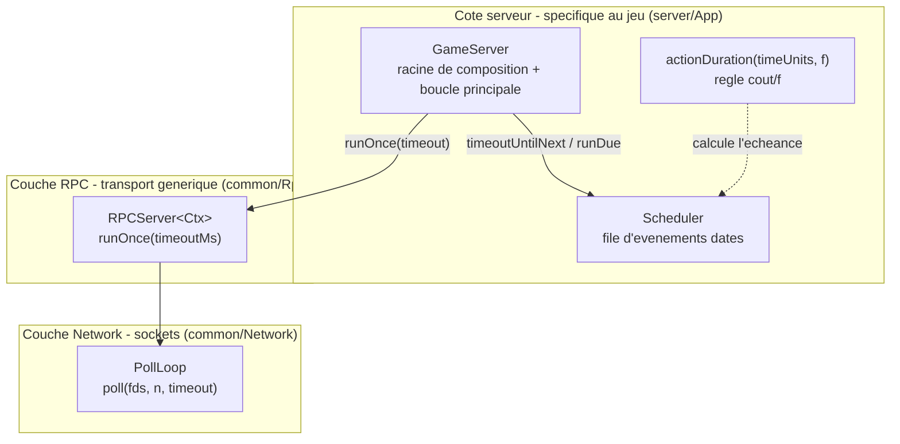
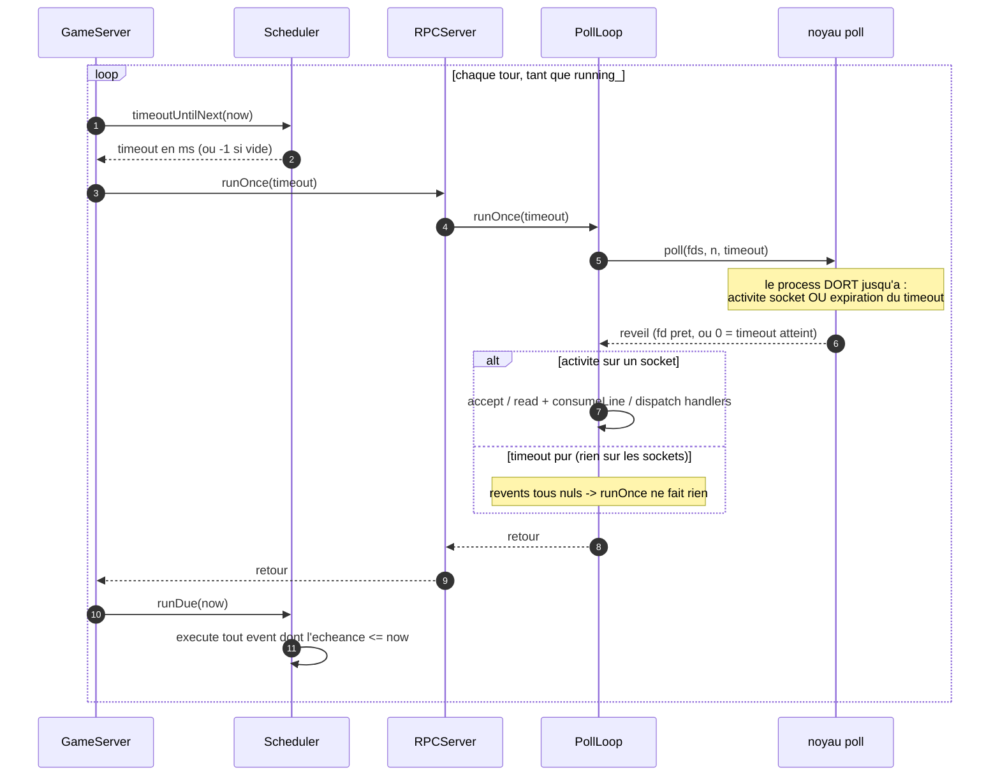
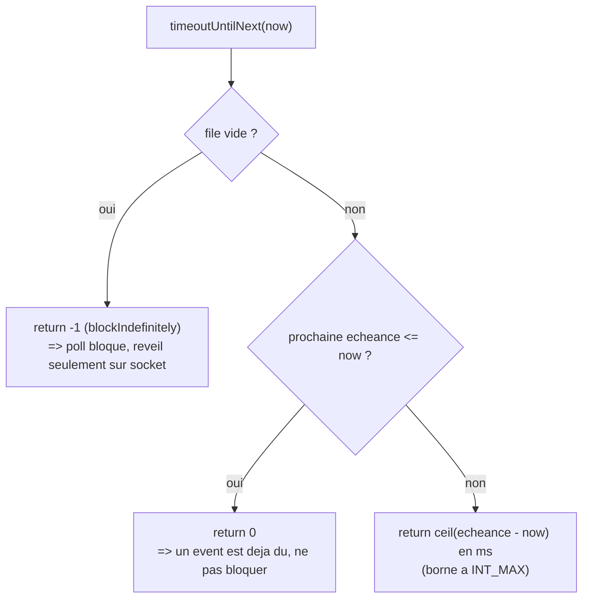
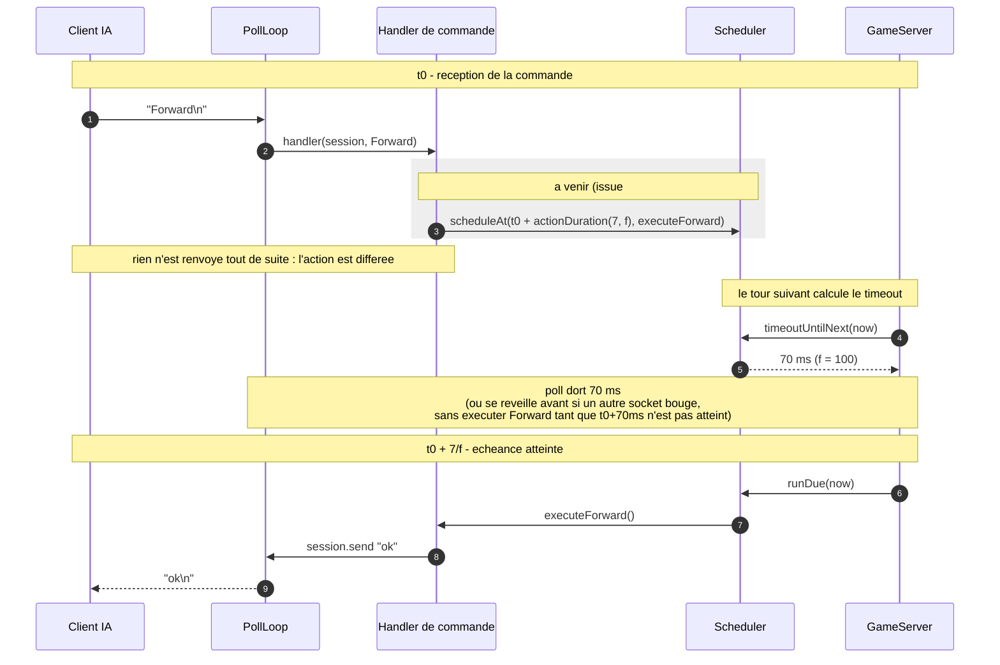
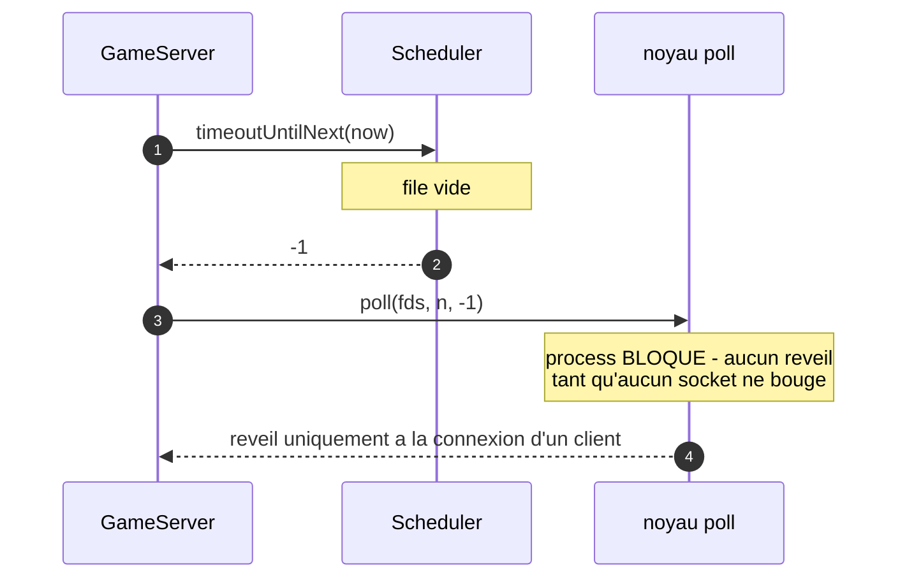

# Zappy — Architecture du Scheduler (temps & boucle sans attente active)

> Ce document décrit **uniquement** le moteur de temps du serveur : comment les
> actions de jeu sont planifiées dans le futur et exécutées **sans aucune
> attente active**, en pilotant le timeout de `poll`. C'est le « quand ça
> s'exécute » du projet (issue **#3**).
>
> Pour le « comment ça parle » (sockets, framing, dispatch typé), voir
> [`ARCHITECTURE.cRPC.md`](ARCHITECTURE.cRPC.md). Pour le « quoi/pourquoi »
> global, voir [`ARCHITECTURE.md`](../ARCHITECTURE.md).
>
> Code concerné : [`server/App/Scheduler/`](../server/App/Scheduler/)
> (`Scheduler`, `ActionTiming`, `Exceptions/`) et la boucle dans
> [`server/App/GameServer.cpp`](../server/App/GameServer.cpp).

---

## 1. Le problème : « no active waiting »

Le sujet impose (vérifié au **`strace`** par le jury) :

> Le serveur doit utiliser `poll` pour le multiplexage ; le `poll` ne doit se
> débloquer **que** si quelque chose se passe sur un socket **ou** si un
> événement est prêt à être exécuté.

Autrement dit, **deux** sources de réveil et **aucune** boucle de scrutation :

1. **activité réseau** — un client se connecte, envoie, se déconnecte ;
2. **échéance de jeu** — une action différée arrive à terme.

Quand ni l'un ni l'autre n'est imminent, le process doit **dormir** (0 % CPU),
pas tourner en rond avec un `timeout` court.

La difficulté : une commande IA n'est **pas** exécutée à réception. Son coût est
`durée_action / f` secondes (Forward = 7/f, Incantation = 300/f…). Il faut donc
la **planifier** à `maintenant + coût/f`, puis réveiller la boucle pile à cette
échéance — sans bloquer les autres joueurs entre-temps.

---

## 2. Les trois pièces et qui possède quoi

Trois responsabilités distinctes, dans **trois couches différentes** :



**Pourquoi le `Scheduler` est côté serveur et non dans `common/Network` ?**

- `common/Network` et `common/Rpc` sont une **couche transport générique**
  (templatée sur `Ctx`, reprise de `my_teams`) : elle ne connaît **rien** au
  jeu. Le scheduler, lui, porte des **callbacks de logique de jeu** (déplacer un
  joueur, respawn, mort par faim). Le faire vivre dans le transport mélangerait
  les couches.
- Un scheduler de deadlines n'est de toute façon **pas un concept réseau**.
- Le **seul** consommateur est le serveur. Le seam existe déjà :
  `RPCServer::runOnce(int timeoutMs)` a été conçu pour qu'« un game scheduler
  puisse piloter les réveils ». **GameServer** compose donc `poll` + scheduler
  **sans modifier une ligne de la couche réseau**.

---

## 3. Le cœur : la boucle `GameServer::run()`

Toute la magie tient en quatre lignes — GameServer possède la boucle et, à
chaque tour, demande au scheduler combien de temps il peut dormir, fait **un**
tour de `poll`, puis exécute ce qui est devenu dû :

```cpp
void GameServer::run() {
  running_ = true;
  while (running_) {
    server_.runOnce(scheduler_.timeoutUntilNext(Scheduler::Clock::now()));
    scheduler_.runDue(Scheduler::Clock::now());
  }
}
```



Le point clé : `runDue` est appelé **après chaque** `poll`, que le réveil vienne
d'un socket **ou** du timeout. Si une échéance est passée pendant qu'on traitait
des I/O, elle est quand même exécutée ce tour-ci (la comparaison se fait sur
`now`, pas sur la cause du réveil).

---

## 4. Le `Scheduler` — file d'événements datés

[`Scheduler`](../server/App/Scheduler/Scheduler.hpp) est une `std::multimap<
TimePoint, Callback>` triée par échéance (`begin()` = la plus proche). Il **ne
lit jamais l'horloge lui-même** : le `now` est passé en paramètre, ce qui rend
son comportement **déterministe et testable sans `sleep`**.

| Méthode | Rôle |
|---|---|
| `scheduleAt(deadline, action)` | enregistre un callback à exécuter une fois `deadline` passé |
| `timeoutUntilNext(now)` | combien de ms `poll` peut dormir (voir ci-dessous) |
| `runDue(now)` | exécute, du plus tôt au plus tard, tout event dû ; le retire **avant** de l'appeler (un callback peut donc re-planifier) |
| `empty()` / `pendingCount()` | introspection |

La logique de `timeoutUntilNext` est ce qui traduit « réveille-toi sur socket
**ou** sur échéance » en un seul entier passé à `poll` :



Le `ceil` (arrondi **au-dessus**) garantit que lorsque `poll` rend la main sur
timeout, l'échéance est bien atteinte (`now >= deadline`) — pas de réveil une
fraction de ms trop tôt qui ferait tourner la boucle pour rien.

---

## 5. `actionDuration` — la règle `coût / f`

[`actionDuration(timeUnits, frequency)`](../server/App/Scheduler/ActionTiming.hpp)
encode la règle du sujet : une action de `N` unités de temps dure `N / f`
secondes. C'est ce que le futur code d'action (#8) ajoutera à `now` pour obtenir
l'échéance.

| Action | Coût (unités) | À `f = 100` |
|---|---|---|
| Forward / Right / Left / Look / Broadcast / Eject / Take / Set | 7 | 70 ms |
| Inventory | 1 | 10 ms |
| Fork | 42 | 420 ms |
| Incantation | 300 | 3000 ms |
| Connect_nbr | 0 | immédiat (échéance = `now`) |

`f` divise le coût : il **doit** être strictement positif. Sinon
`actionDuration` lève `InvalidFrequencyException` (cf. R12,
[`Exceptions/SchedulerException.hpp`](../server/App/Scheduler/Exceptions/SchedulerException.hpp)).
En pratique le parser CLI borne déjà `-f` à `[1, max]` ; la validation est donc
défensive (tests, futur changement à chaud de `f` par le GUI, #15).

---

## 6. Cycle de vie d'une action différée (cible, #8)

Voici le flux complet visé une fois les actions câblées (issue **#8**). La zone
grisée est la seule partie pas encore branchée : aujourd'hui le `Scheduler`
existe et la boucle le pilote, mais aucun handler n'y planifie encore d'action.



Conséquence importante du design : le délai ne bloque **que** le joueur qui a
lancé l'action. La boucle continue de servir les autres sockets pendant les
70 ms ; seul `executeForward` est retardé.

---

## 7. Au repos : la preuve « strace »

Sans client ni événement, la file est vide → `timeoutUntilNext` renvoie `-1` →
`poll` bloque indéfiniment. Le process est **endormi**, 0 % CPU, jusqu'à ce
qu'un client se connecte.



Ce qu'un `strace` montre : **un seul** `poll(...)` qui reste suspendu, jamais une
suite de `poll(..., 0)` qui rendent la main immédiatement. C'est exactement le
critère noté par le jury.

---

## 8. Testabilité

Comme `now` est un **paramètre** (jamais `Clock::now()` en interne), les tests
fabriquent un temps fictif (`base()` = un `TimePoint` fixe) et vérifient la
logique au point près, **sans dormir** :

```cpp
Scheduler s;
s.scheduleAt(base() + 100ms, [] {});
EXPECT_EQ(s.timeoutUntilNext(base()),         100);  // delai exact
EXPECT_EQ(s.timeoutUntilNext(base() + 100ms),   0);  // deja du
```

Couverture dans [`tests/Scheduler/`](../tests/Scheduler/) : ordre d'exécution
(earliest-first), seuil d'échéance, file vide → `-1`, re-planification depuis un
callback, et la table `coût/f` (`actionDuration(7, 100) == 70 ms`,
`actionDuration(0, …) == 0`, `f <= 0` → exception).

---

## 9. Ce qui reste à brancher

| Élément | État |
|---|---|
| `poll` multiplexage, sans attente active | ✅ fait (`PollLoop`) |
| `Scheduler` (file d'échéances) | ✅ fait |
| Boucle pilotée par le timeout du scheduler | ✅ fait (`GameServer::run`) |
| Règle `coût / f` (`actionDuration`) | ✅ fait |
| **Handlers qui planifient les actions** | ⏳ issue **#8** |
| **Buffer 10 requêtes / blocage par joueur** | ⏳ issue **#4** |
| Changement à chaud de `f` par le GUI | ⏳ issue **#15** |

Le scheduler est donc **prêt à recevoir des actions** ; il ne manque que les
handlers de l'issue #8 qui appelleront
`scheduler_.scheduleAt(now + actionDuration(coût, f), callback)`.
