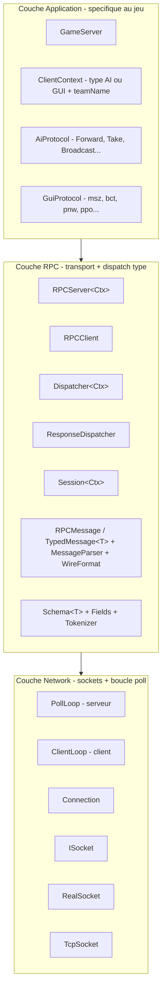
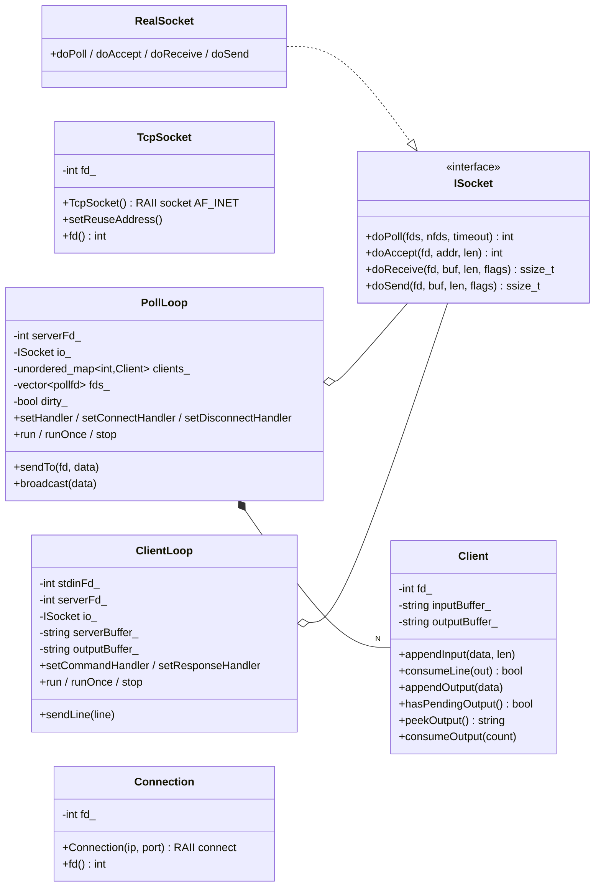
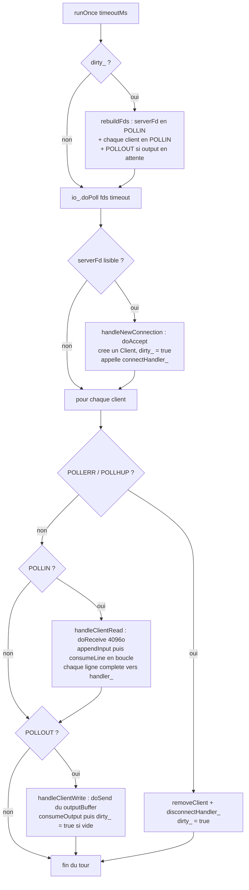
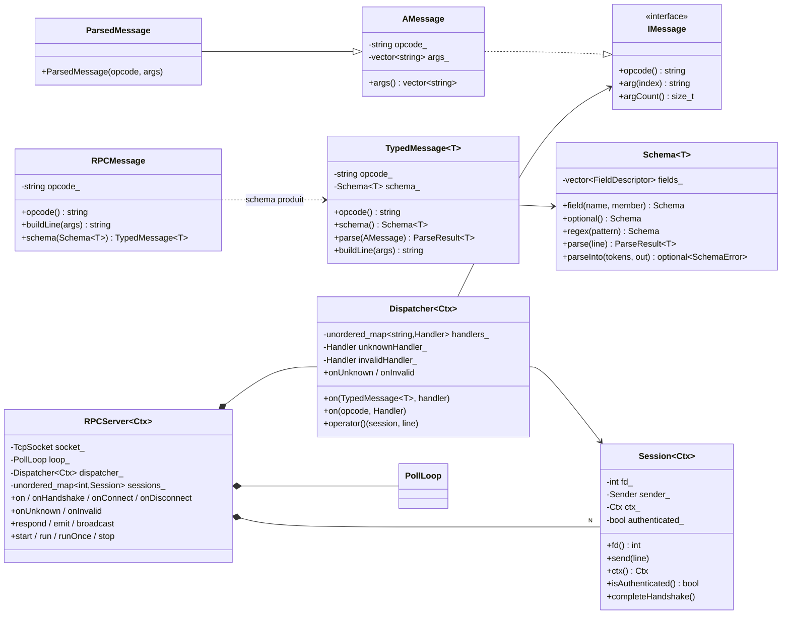
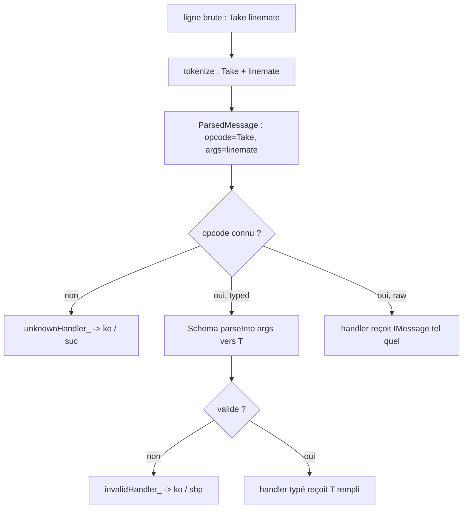
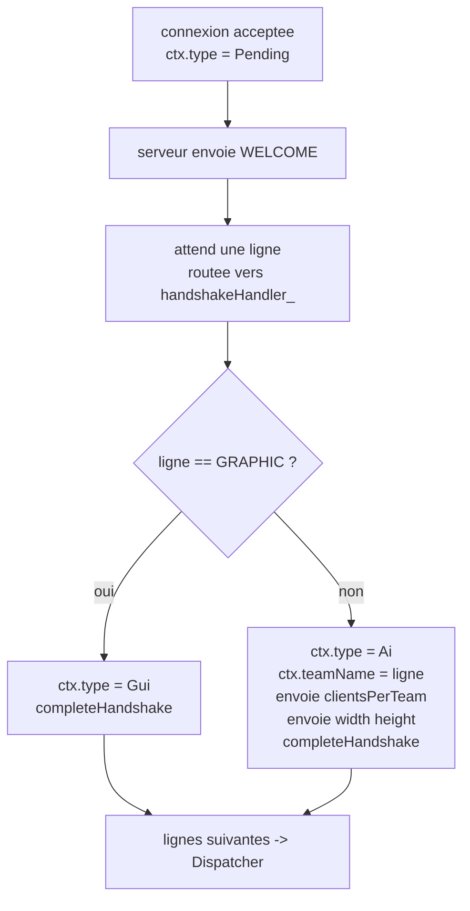
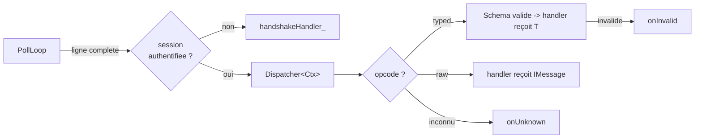
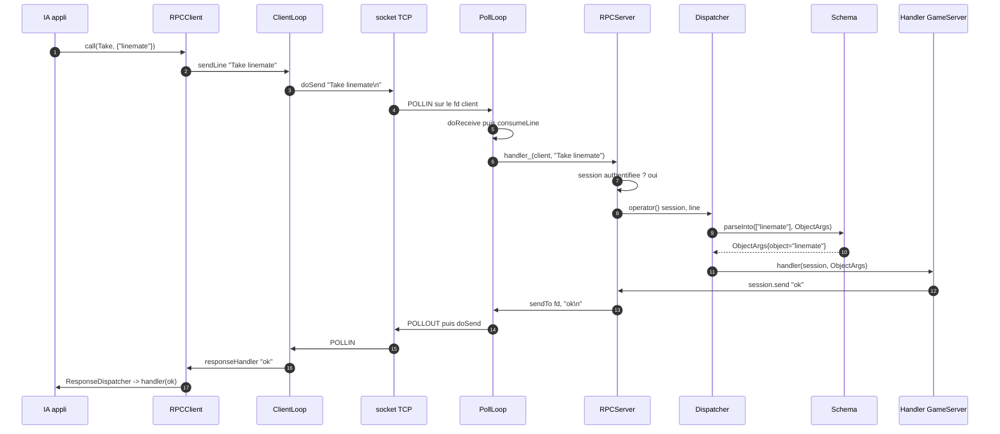

# Zappy — Architecture cRPC

> Ce document décrit **uniquement** la couche réseau + RPC introduite par la PR
> `feat/server-network-primitives-and-protocols`. C'est le « comment ça parle »
> du projet : sockets, boucle `poll`, framing ligne, dispatch typé.
>
> Pour le « quoi/pourquoi » global (jeu, répartition, planning), voir
> [`ARCHITECTURE.md`](../ARCHITECTURE.md). Pour le contenu byte-exact des
> protocoles, voir [`PROTOCOL.AI.md`](PROTOCOL.AI.md) et
> [`PROTOCOL.GUI.md`](PROTOCOL.GUI.md).
>
> Cette couche est **reprise de `my_teams`** (même découpage Network / RPC /
> Application). La différence Zappy : un **seul port** héberge les deux
> protocoles (IA et GUI), distingués par le handshake.

---

## 1. Qu'est-ce que ce « cRPC » ?

**RPC = Remote Procedure Call.** L'idée : exposer côté serveur des « fonctions »
qu'un client appelle à distance, comme si elles étaient locales. Ici ce n'est
**ni gRPC, ni JSON-RPC** — c'est une implémentation maison minimale au-dessus
d'un **protocole texte, une ligne par message** :

- une « procédure » = un **opcode** (ex. `Forward`, `msz`, `Broadcast`) ;
- un « appel » = une ligne envoyée sur le socket : `OPCODE arg1 arg2 …\n` ;
- une « réponse » = une ligne renvoyée dans l'autre sens : `ok\n`, `msz 10 10\n`.

Le « c » devant RPC = **C++** : tout est typé à la compilation via des templates
(`Schema<T>`, `TypedMessage<T>`, `Session<Ctx>`), sans réflexion runtime.

Tout l'intérêt : le code applicatif (les handlers du `GameServer`) **ne voit
jamais** un `recv()`, un `send()`, un `split` de chaîne ni un cast. Il reçoit un
`Session<Ctx>&` et des arguments **déjà parsés et validés**.

```cpp
// Serveur — aucun recv, aucun parse, aucun cast
server.on(ai::Take, [](Session& session, const ai::ObjectArgs& args) {
    // args.object est déjà validé et extrait
});
```

### Glossaire des composants

| Composant                    | Rôle                                              | Analogie mentale          |
| ---------------------------- | ------------------------------------------------- | ------------------------- |
| `RPCMessage`                 | déclaration d'un opcode sans args                 | une fonction `void`       |
| `TypedMessage<T>`            | opcode + `Schema<T>` lié à un struct `T`          | une fonction `f(T)`       |
| `Schema<T>`                  | règles de validation + binding champs → `T`       | la signature typée        |
| `IMessage` / `ParsedMessage` | message reçu (opcode + args bruts)                | une frame de call-stack   |
| `Dispatcher<Ctx>`            | table opcode → handler (côté serveur)             | une vtable                |
| `ResponseDispatcher`         | table opcode → handler (côté client)              | idem, pour les réponses   |
| `Session<Ctx>`               | le « this » d'une connexion : fd + contexte appli | le receiver de la méthode |
| `RPCServer<Ctx>`             | façade serveur : `.on(msg, handler)`              | un « service RPC »        |
| `RPCClient`                  | façade client : `.call(msg, {…})`                 | un « stub client »        |

### Qui est client, qui est serveur ?

« RPC » est, par définition, une conversation **à deux** : quelqu'un **appelle**
(le client) et quelqu'un **exécute** (le serveur). Il y a donc forcément un côté
client *et* un côté serveur. Dans Zappy, ça se mappe sur les trois binaires :

| Binaire | Rôle RPC | Classe `common/` utilisée |
|---|---|---|
| `zappy_server` | **serveur** : écoute 1 port, accepte **N** connexions, exécute un handler par commande reçue | `RPCServer<ClientContext>` |
| `zappy_gui` | **client** : se connecte à **1** serveur, envoie des requêtes, réagit aux events | `RPCClient` |
| `zappy_ai` | **client** : 1 drone = 1 connexion ; envoie des commandes, lit les réponses | `RPCClient` |

**Pourquoi les deux façades vivent dans `common/` ?** Parce que `common/` est une
lib **liée par les trois binaires**. En y mettant *et* le serveur *et* le client,
les définitions de messages (`Take`, `msz`, le `WireFormat`, les `Schema`) sont
écrites **une seule fois** et partagées : le serveur et le client utilisent
littéralement le **même** objet `Take` — impossible qu'ils divergent sur le format.

Les deux côtés sont **symétriques** (images miroir) :

| Côté serveur (`zappy_server`) | Côté client (`zappy_gui` / `zappy_ai`) |
|---|---|
| `RPCServer<Ctx>` | `RPCClient` |
| `PollLoop` — surveille **N** clients | `ClientLoop` — surveille **1** serveur (+ stdin) |
| `Dispatcher` — route les **commandes reçues** | `ResponseDispatcher` — route les **réponses reçues** |
| une `Session<Ctx>` par connexion | pas de `Session` (une seule connexion) |
| `.on(Take, handler)` — « je sais faire Take » | `.call(Take, {…})` puis `.on(msz, h)` — « j'appelle, je lis » |

> Analogie restaurant : le **serveur** = la cuisine (`zappy_server`) qui reçoit
> les commandes de **toutes** les tables et prépare les plats (les handlers). Les
> **clients** = les convives (`gui`/`ai`), chacun à **sa** table, qui passent
> commande et reçoivent leur plat. Le **menu** (`common/Protocol`) est imprimé une
> fois et lu par la cuisine *et* les convives — personne ne se trompe de plat.

---

## 2. Le stack en trois couches

L'architecture s'empile en **trois couches indépendantes**, chacune ignorant ce
qu'il y a au-dessus. Règle d'or : **jamais** de `recv()` / `send()` / `poll()`
dans la couche Application.



Deux binaires symétriques :

- **serveur** = `RPCServer<Ctx>` → `PollLoop` (1 socket d'écoute, N clients) ;
- **client** = `RPCClient` → `ClientLoop` (stdin optionnel + 1 socket serveur).

Tous deux passent par `ISocket` pour pouvoir être **testés sans vrais sockets**
(injection d'un mock).

---

## 3. Couche Network — `poll()` et I/O bufferisée

### 3.1 Les composants



- **`ISocket`** : 4 méthodes (`doPoll`, `doAccept`, `doReceive`, `doSend`). Tout
  passe par là. `RealSocket` les mappe sur les syscalls POSIX (avec un fallback
  `read(2)` si `recv` renvoie `ENOTSOCK`, utile pour stdin/pipe).
- **`TcpSocket`** : RAII autour de `socket(AF_INET, SOCK_STREAM)`. Non-copiable,
  movable. `setReuseAddress()` pour relancer le serveur sans `TIME_WAIT`.
- **`Connection`** : RAII côté client — `socket` + `inet_pton` + `connect` +
  `TCP_NODELAY`. Lève `ConnectError` en cas d'échec.
- **`Client`** : l'état d'un client connecté côté serveur. **Aucun syscall** ici,
  juste deux buffers `string` (entrée / sortie) et le **framing par `\n`** via
  `consumeLine()`.

### 3.2 Le framing : une ligne = un message

Le délimiteur est `\n`. `Client::consumeLine()` cherche le prochain `\n` dans le
buffer d'entrée ; s'il existe, il renvoie la ligne (sans le `\n`) et l'efface du
buffer ; sinon il renvoie `false` (message incomplet, on attend la suite). C'est
ce qui rend la lecture **non bloquante** robuste aux paquets TCP fragmentés.

### 3.3 La boucle serveur : `PollLoop::runOnce`

Le cœur « pas d'attente active ». À chaque tour :



Points clés :

- **`dirty_`** : on ne reconstruit le tableau `pollfd` que quand il change
  (connexion, déconnexion, apparition/disparition d'output). Pas de reconstruction
  inutile à chaque tour.
- **`POLLOUT` à la demande** : on ne surveille l'écriture que si un client a de
  l'output en attente. Sinon `poll` ne se réveillerait jamais inutilement.
- **timeout injectable** : `run(timeoutMs)` / `runOnce(timeoutMs)` passent le
  timeout à `poll`. C'est par là qu'un futur `TimeScheduler` de jeu fixera le
  délai jusqu'au prochain événement (`-1` = bloquer jusqu'à activité réseau).
- `sendTo(fd, data)` / `broadcast(data)` n'écrivent **pas** directement : ils
  empilent dans le `outputBuffer_` du client et lèvent `dirty_` pour activer
  `POLLOUT` au prochain tour.

### 3.4 La boucle client : `ClientLoop`

Même principe, mais **deux fds** : `stdin` (optionnel — `-1` pour le désactiver,
ex. un GUI qui gère ses propres entrées) et le socket serveur. Les lignes lues
sur stdin partent vers `commandHandler_`, celles du serveur vers
`responseHandler_`. `sendLine()` empile `ligne + "\n"` dans l'output et active
`POLLOUT`.

### 3.5 Hiérarchie d'exceptions

```
std::runtime_error
  └─ NetworkError            (base de la couche réseau)
      ├─ SocketError         socket() / setsockopt() échoue
      ├─ BindError           bind() échoue
      ├─ ListenError         listen() échoue
      ├─ ConnectError        connect() échoue (côté client)
      ├─ AcceptError         accept() renvoie -1
      └─ PollError           poll() renvoie une erreur fatale (≠ EINTR)
```

Elles remontent jusqu'à `main`, qui les attrape et sort en **code 84** (norme
Epitech).

---

## 4. Couche RPC — messages, schéma, dispatch

### 4.1 Vue des classes



### 4.2 Définir un message : `RPCMessage` → `TypedMessage<T>`

Un protocole déclare ses messages **une seule fois**, partagés serveur **et**
client (zéro divergence possible). Deux formes :

```cpp
// 1) Message SANS argument — un simple opcode
const RPCMessage Forward{"Forward"};
const RPCMessage Ok{"ok"};

// 2) Message AVEC arguments — on lie un Schema<T> => TypedMessage<T>
struct ObjectArgs { std::string object; };

const Schema<ObjectArgs> ObjectSchema =
    Schema<ObjectArgs>{}.field<StringFieldType>("object", &ObjectArgs::object);

const TypedMessage<ObjectArgs> Take = RPCMessage{"Take"}.schema(ObjectSchema);
```

- `RPCMessage::schema(Schema<T>)` renvoie un `TypedMessage<T>` qui **mémorise un
  pointeur** vers le schéma (les schémas sont des `const` à durée de vie statique).
- `buildLine(args)` encode la ligne via `WireFormat` (voir §4.4) — c'est ce qui
  sert à **émettre** un message.

### 4.3 `Schema<T>` — validation + binding vers un struct

`Schema<T>` est un **builder fluide**. Chaque `field<FieldType>(nom, &T::membre)`
ajoute un champ positionnel, lié à un membre `std::string` du struct cible via un
**pointeur-sur-membre** (`std::string T::*`) — pas de réflexion, pas de setter.

```cpp
const Schema<BroadcastArgs> BroadcastSchema =
    Schema<BroadcastArgs>{}
        .field<NumberFieldType>("playerNumber", &BroadcastArgs::playerNumber)
        .field<LongStringFieldType>("message", &BroadcastArgs::message);
// .parse("5 hello world")  =>  playerNumber="5", message="hello world"
```

Modificateurs chaînables juste après un `field(...)` :

- `.optional()` — champ absent toléré (membre laissé vide) ;
- `.regex(motif)` — contrainte `std::regex_match` après la validation de type.

Les **types de champ** implémentent `IFieldType` :

| Type                  | Valide                    | Tokens consommés                                    |
| --------------------- | ------------------------- | --------------------------------------------------- |
| `NumberFieldType`     | entier signé `[-]?[0-9]+` | 1                                                   |
| `StringFieldType`     | tout token non vide       | 1                                                   |
| `LongStringFieldType` | hérite de String          | **tout le reste de la ligne** (`consumesRemainder`) |

`LongStringFieldType` est la clé des messages « texte libre » (un `Broadcast`
multi-mots) : placé en dernier, il absorbe tous les tokens restants, rejoints par
des espaces.

#### Le pipeline de parsing d'une ligne



`Schema::parseInto` renvoie un `std::optional<SchemaError>` (`nullopt` = succès).
Les vérifications, dans l'ordre : arité (trop/pas assez d'arguments), puis pour
chaque champ — type (`IFieldType::validate`), puis regex si présente, puis
assignation `out.*membre = valeur`. Toute erreur produit un `SchemaError{field,
message}` (ex. `"width: expected number, got 'abc'"`).

### 4.4 `WireFormat` — encodage de la ligne sortante

`buildWireLine(opcode, args)` colle l'opcode et les arguments séparés par des
espaces. Un argument **vide, ou contenant un espace ou un guillemet** est mis
entre `"…"` avec les guillemets internes échappés (`\"`). Pas de `\n` final (il
est ajouté par `Session::send` / `ClientLoop::sendLine`). Le `Tokenizer` côté
réception fait l'inverse (dé-quote, dé-échappe).

### 4.5 `Dispatcher<Ctx>` — router une ligne vers le bon handler

`Dispatcher` détient une `unordered_map<opcode, Handler>`. `operator()(session,
line)` parse la ligne en `ParsedMessage` puis route vers `handlers_[opcode]`, ou
`unknownHandler_` si l'opcode est inconnu (ligne vide = ignorée).

**Deux styles d'enregistrement :**

```cpp
// Style typé — Schema valide + remplit T AVANT d'appeler le handler
dispatcher.on(ai::Take, [](Session& s, const ai::ObjectArgs& args) {
    // args.object déjà validé
});

// Style brut — le handler reçoit l'IMessage tel quel
dispatcher.on(ai::Forward.opcode(), [](Session& s, IMessage& msg) {
    // msg.arg(i), msg.argCount()
});
```

Le style typé enveloppe le handler dans un lambda qui : (1) récupère
`message.args()`, (2) appelle `schema.parseInto`, (3) si OK appelle ton handler
avec le `T` rempli, (4) si KO appelle `invalidHandler_` (ou envoie `"sbp"` par
défaut). C'est `onInvalid` qui permet à un protocole de répondre `ko` (IA) plutôt
que `sbp` (GUI).

### 4.6 `Session<Ctx>` — le « this » d'une connexion

Chaque client accepté crée un `Session<Ctx>` (clé = fd) stocké dans
`RPCServer::sessions_`. Il porte :

- `fd()` — le descripteur ;
- `send(line)` — un callback opaque (`Sender`) qui empile vers le bon client
  **sans connaître le transport** ; le `\n` est ajouté automatiquement ;
- `ctx()` — le contexte applicatif (`ClientContext` pour Zappy), **value-init**
  à la connexion, vivant toute la durée de la session ;
- `isAuthenticated()` / `completeHandshake()` — le verrou de handshake (§5).

---

## 5. Le handshake — un seul port, deux protocoles

C'est **la** spécificité Zappy par rapport à `my_teams`. Tant qu'une session n'a
pas `completeHandshake()`, `RPCServer` route ses lignes vers le
`handshakeHandler_` **au lieu** du `Dispatcher`. Le handshake résout le type de
client (IA ou GUI) à partir du **nom d'équipe**.



Le code réel (`GameServer::registerHandshake`) :

```cpp
server_.onConnect([](Session& s) { s.send("WELCOME"); });

server_.onHandshake([this](Session& s, const std::string& teamName) {
    if (teamName == "GRAPHIC") {
        s.ctx().type = ClientType::Gui;
        s.completeHandshake();
        return;
    }
    s.ctx().type = ClientType::Ai;
    s.ctx().teamName = teamName;
    s.send(std::to_string(config_.clientsPerTeam));        // slots dispo
    s.send(std::to_string(config_.width) + " " +
           std::to_string(config_.height));                // X Y
    s.completeHandshake();
});
```

Un serveur **sans** `onHandshake` considère toute session comme authentifiée
d'emblée (`isAuthenticated()` renvoie `true` par défaut) — le handshake est donc
**opt-in**.

---

## 6. `RPCServer<Ctx>` — la façade serveur

`RPCServer` câble tout dans son constructeur : il possède un `TcpSocket`, un
`RealSocket`, un `PollLoop`, un `Dispatcher<Ctx>` et la map des sessions. Il
**branche les trois handlers du `PollLoop`** :

- `setConnectHandler` → crée la `Session`, appelle `connectHandler_` ;
- `setHandler` (par ligne) → **si** handshake non terminé, route vers
  `handshakeHandler_` ; **sinon** vers `dispatcher_(session, line)` ;
- `setDisconnectHandler` → appelle `disconnectHandler_`, efface la session.



API principale :

| Méthode                                            | Rôle                                            |
| -------------------------------------------------- | ----------------------------------------------- |
| `on(TypedMessage<T>, f)`                           | handler **typé** (args validés + struct rempli) |
| `on(RPCMessage, f)` / `on(opcode, f)`              | handler **brut** (`IMessage&`)                  |
| `onHandshake(f)`                                   | gère la séquence de greeting (§5)               |
| `onConnect(f)` / `onDisconnect(f)`                 | cycle de vie connexion                          |
| `onUnknown(f)` / `onInvalid(f)`                    | opcode inconnu / échec de schéma                |
| `respond(session, msg, args)` / `emit(...)`        | répondre / pousser à 1 client                   |
| `broadcast(msg, args)`                             | pousser à tous                                  |
| `forEachSession(fn)`                               | itérer toutes les sessions                      |
| `start()`                                          | `setReuseAddress` + `bind` + `listen`           |
| `run(timeoutMs)` / `runOnce(timeoutMs)` / `stop()` | boucle                                          |

Astuce test : `RPCServer<Ctx> server(0)` → `start()` choisit un **port éphémère**
récupérable via `port()`. C'est ce qui permet les tests d'intégration sur
loopback sans port en dur.

---

## 7. `RPCClient` — la façade client

Symétrique de `RPCServer`. Possède une `Connection` (RAII), un `ClientLoop` et un
`ResponseDispatcher`. Trois constructeurs :

```cpp
RPCClient(ip, port);                 // multiplexe stdin + socket
RPCClient(ip, port, pollStdin);      // pollStdin=false : GUI sans stdin
RPCClient(stdinFd, serverFd, io);    // injection (fd + ISocket mock) pour les tests
```

- `call(message, args)` → `loop_.sendLine(message.buildLine(args))` ;
- `send(line)` → ligne brute ;
- `on(TypedMessage<T>, f)` / `on(opcode, f)` → réponses serveur (typées ou brutes) ;
- `onStdin(f)` → lignes tapées au clavier ;
- `onUnknown(f)`, `run()`, `runOnce(timeoutMs=50)`, `stop()`.

`ResponseDispatcher` est le pendant de `Dispatcher` **sans `Session`** (les
handlers ne reçoivent qu'un `IMessage` ou un `T`). Différence importante : en cas
d'échec de schéma, il **drop silencieusement** la ligne (un client ignore un
message serveur mal formé, il ne lui « répond » pas).

---

## 8. Cycle de vie complet — bout en bout

Un client IA envoie `Take linemate`. Voici le trajet **à travers les trois
couches**, du clavier jusqu'au handler et retour.



À **aucun** moment le handler du `GameServer` ne voit d'octets bruts, de `recv()`,
de découpage de chaîne ou de conversion. Idem côté client.

---

## 9. Comment `GameServer` câble le tout

`GameServer` est le **seul** point d'assemblage applicatif. Son constructeur
enregistre quatre familles de handlers sur un unique `RPCServer<ClientContext>` :

```cpp
GameServer::GameServer(const ServerConfig& config)
    : config_(config), server_(config.port) {
    registerHandshake();    // WELCOME + routage AI/GUI (§5)
    registerGuiHandlers();  // msz, mct, tna, sgt, bct, ppo, plv, pin, sst
    registerAiHandlers();   // Forward, Right, Take, Set, Broadcast...
    registerFallbacks();    // onUnknown / onInvalid -> ko (AI) ou suc/sbp (GUI)
}
```

Les deux protocoles **coexistent sur le même dispatcher** sans collision (les
opcodes IA et GUI sont distincts). Le routage final dépend du `ClientContext.type`
résolu au handshake — visible dans les fallbacks :

```cpp
server_.onUnknown([](Session& s, IMessage&) {
    if (s.ctx().type == ClientType::Ai) { s.send(ai::Ko.opcode()); return; }
    s.send(UnknownCommand.opcode());     // "suc"
});
```

> État actuel de la PR : les handlers de jeu sont des **stubs vides** (`[](Session&,
…) {}`). Cette PR pose la **plomberie réseau + RPC + protocole** ; la logique de
> jeu (Domain, Systems, TimeScheduler) viendra brancher sa logique dans ces
> handlers déjà câblés.

`main.cpp` est minimal et porte le **code de sortie 84** :

```cpp
int main(int argc, char** argv) {
    try {
        auto config = parseArguments(argc, argv);   // ServerConfig
        GameServer server(config);
        server.start();
        std::cout << "zappy server listening on port " << server.port() << '\n';
        server.run();
    } catch (const std::exception& e) {
        std::cerr << "fatal: " << e.what() << '\n';
        return 84;
    }
    return 0;
}
```

---

## 10. Carte des fichiers

| Fichier                                  | Couche      | Rôle                                        |
| ---------------------------------------- | ----------- | ------------------------------------------- |
| `common/Network/Socket/ISocket.hpp`      | Network     | interface I/O injectable                    |
| `common/Network/Socket/RealSocket.*`     | Network     | impl. POSIX (syscalls)                      |
| `common/Network/Socket/TcpSocket.*`      | Network     | RAII socket d'écoute                        |
| `common/Network/Server/Client.*`         | Network     | buffers + framing `\n` (serveur)            |
| `common/Network/Server/PollLoop.*`       | Network     | boucle `poll` serveur                       |
| `common/Network/Client/Connection.*`     | Network     | RAII `connect` (client)                     |
| `common/Network/Client/ClientLoop.*`     | Network     | boucle `poll` client (stdin+socket)         |
| `common/Network/Exceptions.*`            | Network     | hiérarchie `NetworkError`                   |
| `common/Rpc/Message/IMessage.*`          | RPC         | `IMessage` / `AMessage` / `ParsedMessage`   |
| `common/Rpc/Message/RPCMessage.*`        | RPC         | opcode + `buildLine` + `schema()`           |
| `common/Rpc/Message/TypedMessage.hpp`    | RPC         | opcode lié à un `Schema<T>`                 |
| `common/Rpc/Message/MessageParser.*`     | RPC         | `parseMessage` (ligne → `ParsedMessage`)    |
| `common/Rpc/Message/WireFormat.*`        | RPC         | encodage ligne sortante (quoting)           |
| `common/Schema/Schema.hpp`               | RPC         | `Schema<T>`, `ParseResult<T>`               |
| `common/Schema/Fields/*`                 | RPC         | `IFieldType` + Number/String/LongString     |
| `common/Schema/Tokenizer.*`              | RPC         | découpe ligne → tokens (quotes/échappement) |
| `common/Schema/SchemaError.*`            | RPC         | erreur de validation `{field, message}`     |
| `common/Rpc/Server/Dispatcher.hpp`       | RPC         | router opcode → handler (serveur)           |
| `common/Rpc/Server/RPCServer.hpp`        | RPC         | façade serveur                              |
| `common/Rpc/Client/ResponseDispatcher.*` | RPC         | router opcode → handler (client)            |
| `common/Rpc/Client/RPCClient.*`          | RPC         | façade client                               |
| `common/Rpc/Session/Session.hpp`         | RPC         | handle par connexion + `Ctx`                |
| `common/Protocol/AiProtocol.*`           | Application | messages IA                                 |
| `common/Protocol/GuiProtocol.*`          | Application | messages GUI                                |
| `server/App/ArgsParser.*`                | Application | `-p -x -y -n -c -f` → `ServerConfig`        |
| `server/App/ServerConfig.hpp`            | Application | config serveur                              |
| `server/App/GameServer.*`                | Application | assemblage + handlers                       |
| `server/Net/ClientContext.hpp`           | Application | `{type, teamName}` par connexion            |
| `server/main.cpp`                        | Application | bootstrap + exit 84                         |

---

## 11. Tests (où regarder pour un exemple vivant)

- `tests/Rpc/TestRPCServer.cpp` — intégration sur **port éphémère** + loopback
  réel (`LoopbackClient`) : bind/listen, connect/disconnect, dispatch typé,
  handshake, fallbacks.
- `tests/Rpc/mocks/LoopbackClient.*` — petit client TCP de test.
- `tests/Network/TestPollLoop.cpp`, `TestClientLoop.cpp` — boucles via
  `MockSocket` (aucun vrai socket).
- `tests/Network/mocks/MockSocket.*` — `ISocket` simulé, scriptable.
- `tests/Rpc/TestWireFormat.cpp`, `tests/Network/TestExceptions.cpp` — unitaires.

Construire : `cmake -B build -DBUILD_TESTS=ON && cmake --build build && ctest
--test-dir build`. Couverture : `tests/coverage.sh`.
